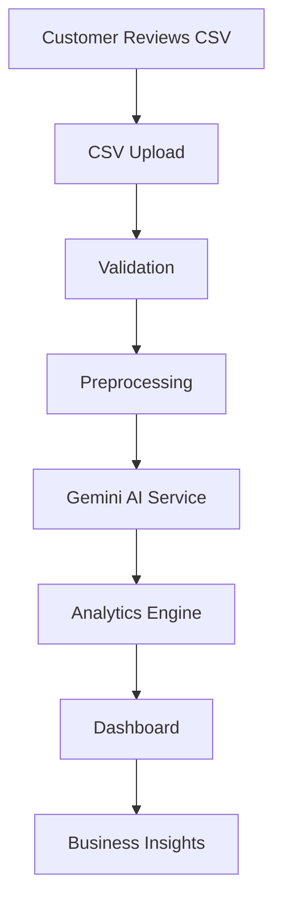
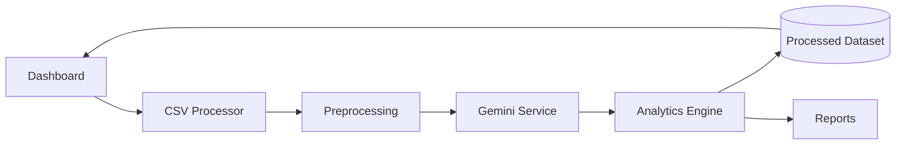
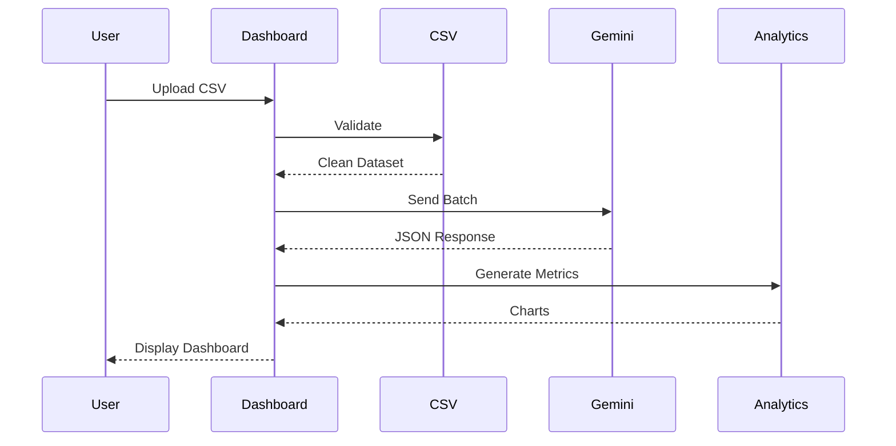

# System Architecture
## AI-Powered Customer Feedback Analytics Platform

**Version:** 1.0

---

# Purpose

This document describes the complete architecture of the AI-Powered Customer Feedback Analytics Platform.

It explains:

- High-Level Architecture
- Low-Level Architecture
- Component Design
- Module Responsibilities
- Data Flow
- Sequence Flow
- Folder Structure
- Design Principles

This document is intended for:

- Developers
- Project Reviewers
- AI Coding Assistants
- Future Contributors

---

# Architecture Overview

The application follows a **Layered Modular Architecture**.

```
                 User
                  │
                  ▼
          Streamlit Dashboard
                  │
                  ▼
          Application Layer
                  │
                  ▼
        Business Logic Layer
                  │
                  ▼
          Gemini AI Service
                  │
                  ▼
        Analytics Engine
                  │
                  ▼
         Data Processing Layer
                  │
                  ▼
             CSV Dataset
```

---

# High-Level Architecture



---

# Architecture Layers

## Presentation Layer

Responsible for:

- User Interface
- CSV Upload
- Filters
- Dashboard
- Reports

Technology

- Streamlit
- Plotly

---

## Application Layer

Responsible for:

- Navigation
- Routing
- Session State
- Page Management

---

## Business Logic Layer

Responsible for:

- Data Cleaning
- Feature Generation
- Analytics
- Report Generation

---

## AI Layer

Responsible for

- Prompt Generation
- Gemini Communication
- JSON Validation
- Retry Strategy
- Batch Processing
- Rate Limiting

---

## Data Layer

Responsible for

- Raw CSV
- Processed Dataset
- Cached Results

---

# Component Diagram



---

# Folder Structure

```
customer-feedback-dashboard/

│
├── docs/
│
├── src/
│   │
│   ├── app.py
│   │
│   ├── config/
│   │
│   ├── services/
│   │
│   │      csv_service.py
│   │
│   │      gemini_service.py
│   │
│   │      analytics_service.py
│   │
│   ├── utils/
│   │
│   ├── pages/
│   │
│   ├── charts/
│   │
│   ├── models/
│   │
│   └── reports/
│
├── data/
│
├── assets/
│
├── tests/
│
├── logs/
│
└── requirements.txt
```

---

# Module Responsibilities

## app.py

Application entry point.

Responsibilities

- Initialize application
- Configure pages
- Load sidebar
- Route navigation

---

## csv_service.py

Responsible for

- CSV upload
- Validation
- Cleaning
- Preview

---

## gemini_service.py

Responsible for

- Prompt creation
- API communication
- Retry mechanism
- Rate limiting
- JSON parsing
- Batch processing

---

## analytics_service.py

Responsible for

- KPI calculation
- Sentiment statistics
- Brand analysis
- Product analysis
- Complaint analysis

---

## charts/

Contains reusable Plotly charts.

Examples

- Pie Chart
- Line Chart
- Bar Chart
- Word Cloud

---

## pages/

Contains Streamlit pages.

Examples

- Overview
- Product Analytics
- Review Explorer
- Reports

---

# Data Flow

```mermaid
flowchart LR

CSV

-->

Validation

-->

Cleaning

-->

Gemini

-->

Generated Columns

-->

Analytics

-->

Dashboard
```

---

# AI Processing Flow

```mermaid
flowchart TD

Review

-->

Batch Builder

-->

Prompt Builder

-->

Gemini API

-->

JSON Validation

-->

Retry

-->

Processed Data
```

---

# Dashboard Flow

```mermaid
flowchart TD

Dataset

-->

Analytics

-->

KPIs

-->

Charts

-->

Dashboard

-->

Business User
```

---

# Sequence Diagram



---

# Request Processing Flow

```
Upload CSV

↓

Validate Columns

↓

Remove Duplicates

↓

Clean Reviews

↓

Generate Features

↓

Batch Reviews

↓

Gemini API

↓

Validate JSON

↓

Append AI Columns

↓

Analytics

↓

Dashboard

↓

Download Processed CSV
```

---

# Design Principles

The architecture follows:

- Layered Design
- Loose Coupling
- High Cohesion
- Modular Components
- Reusable Services
- Separation of Concerns

---

# Error Handling Strategy

Every layer must:

- Validate input
- Catch exceptions
- Log errors
- Return descriptive messages
- Avoid application crashes

---

# Logging Strategy

Every major event should be logged.

Examples

- CSV Uploaded
- Validation Completed
- Gemini Request Sent
- API Failure
- Retry Started
- Dashboard Loaded

---

# Security Architecture

Secrets are stored in

```
.env
```

Never in source code.

Use

```
python-dotenv
```

to load credentials.

---

# Scalability

The architecture supports future additions:

- Database integration
- Live review streaming
- REST API
- User authentication
- Docker deployment
- Cloud deployment
- Multiple AI providers

---

# Technology Mapping

| Layer | Technology |
|--------|------------|
| Frontend | Streamlit |
| Charts | Plotly |
| Data Processing | Pandas |
| AI | Google Gemini |
| Configuration | python-dotenv |
| Logging | logging |
| Language | Python 3.11+ |

---

# Architecture Decisions

| Decision | Reason |
|----------|--------|
| Layered Architecture | Easier maintenance |
| Modular Services | Reusability |
| Streamlit | Rapid dashboard development |
| Gemini API | AI-powered text analysis |
| Pandas | Efficient data processing |
| Plotly | Interactive visualizations |

---

# Definition of Done

The architecture is considered complete when:

- Modules are independent
- Data flows correctly
- AI integration is isolated
- Dashboard is modular
- Logging is implemented
- Error handling is consistent
- Security rules are followed

---

# End of Document