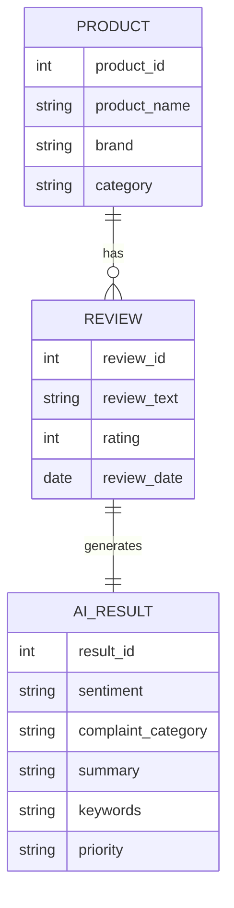

# Database Schema
## AI-Powered Customer Feedback Analytics Platform

**Version:** 1.0

---

# Purpose

This document defines the complete data model used by the AI-Powered Customer Feedback Analytics Platform.

It includes:

- Dataset Schema
- Required Columns
- Generated Columns
- Data Dictionary
- CSV Validation Rules
- Future Database Design
- Entity Relationship Diagram (ERD)
- Data Flow

Although the current implementation uses CSV files, the schema is designed so that it can later be migrated to MySQL or PostgreSQL without changing the application architecture.

---

# Current Storage Architecture

```
Raw Reviews CSV
        │
        ▼
Column Normalization
        │
        ▼
Alias Mapping
        │
        ▼
Fuzzy Matching
        │
        ▼
Schema Validation
        │
        ▼
Preprocessing
        │
        ▼
Gemini AI Enrichment
        │
        ▼
Processed CSV
        │
        ▼
Dashboard
```

---

# Raw Dataset Schema

The application accepts customer review datasets from multiple sources.

Uploaded CSV files are not required to use the standardized internal column names.

During upload, the system automatically:

- Normalizes column names
- Detects common aliases
- Performs intelligent column mapping
- Applies fuzzy matching
- Resolves duplicate columns
- Validates the final schema

After processing, the dataset is standardized into the following internal schema.


---
## Flexible CSV Schema Support

The application automatically recognizes different naming conventions used by datasets from multiple sources.

Supported processing includes:

- Lowercase conversion
- Whitespace trimming
- Hyphen to underscore conversion
- Removal of special characters
- Alias detection
- Intelligent column mapping
- Fuzzy matching
- Duplicate column handling

Example mappings:

| Uploaded Column | Internal Column |
|-----------------|-----------------|
| Review ID | review_id |
| Product | product_name |
| Product Title | product_name |
| Stars | rating |
| Ratings | rating |
| Review | review_text |
| Customer Feedback | review_text |
| Created Date | review_date |
| Timestamp | review_date |

Additional columns are preserved and carried through the pipeline.

### Example Accepted CSV

| Review ID | Product | Stars | Review | Created Date |
|-----------|---------|-------|--------|--------------|
| 1001 | Galaxy A55 | 5 | Excellent battery | 2026-01-10 |

↓

Automatically converted to

| review_id | product_name | rating | review_text | review_date |
|-----------|--------------|--------|-------------|-------------|
# Generated AI Columns

The following columns are generated automatically after Gemini processing.

| Column | Type | Generated By | Description |
|---------|------|--------------|-------------|
| sentiment | String | Gemini | Positive, Neutral, Negative |
| complaint_category | String | Gemini | Battery, Delivery, Camera, etc. |
| summary | Text | Gemini | One-line summary |
| keywords | String | Gemini | Important keywords |
| priority | String | Gemini | High, Medium, Low |

---

# Generated Analytics Columns

During preprocessing additional metadata is created.

| Column | Type | Description |
|---------|------|-------------|
| review_length | Integer | Number of words |
| month | Integer | Review month |
| year | Integer | Review year |
| cleaned_review | Text | Cleaned review text |

---

# Final Processed Dataset

| Column |
|---------|
| review_id |
| product_name |
| brand |
| category |
| rating |
| review_title |
| review_text |
| cleaned_review |
| review_date |
| month |
| year |
| review_length |
| sentiment |
| complaint_category |
| keywords |
| summary |
| priority |

---

# Data Dictionary

## review_id

**Type:** Integer

Unique identifier for every review.

Example

```
10025
```

---

## product_name

**Type:** String

Name of the reviewed product.

---

## rating

**Type:** Integer

Allowed values

```
1
2
3
4
5
```

---

## sentiment

Possible values

```
Positive

Neutral

Negative
```

---

## complaint_category

Examples

```
Battery

Camera

Display

Delivery

Packaging

Performance

Price

Software

Other
```

---

## priority

Possible values

```
High

Medium

Low
```

---

# CSV Validation Rules

Before validation, the application performs automatic schema standardization.

Validation workflow:

1. Read CSV file.
2. Normalize column names.
3. Detect common aliases.
4. Apply fuzzy matching.
5. Resolve duplicate columns.
6. Validate required schema.
7. Validate rating values.
8. Validate date format.

Files are rejected only if mandatory columns cannot be identified after automatic mapping.

Missing values are allowed during upload and are handled during preprocessing.

---

# Data Cleaning Rules

The preprocessing pipeline must:

- Remove duplicate rows
- Trim whitespace
- Remove blank reviews
- Handle missing values
- Normalize ratings
- Convert dates to ISO format
- Generate cleaned review text

---

# Future Database Design

The application currently stores data in CSV files.

Future versions may migrate to a relational database.

Recommended:

- PostgreSQL
- MySQL

---

# Entity Relationship Diagram (Future)



---

# Logical Relationships

```
CSV

↓

Normalization

↓

Alias Mapping

↓

Fuzzy Matching

↓

Validation

↓

Cleaning

↓

Gemini

↓

AI Columns

↓

Analytics

↓

Dashboard

---

# Storage Strategy

## Raw Data

```
data/raw/
```

Contains original uploaded CSV files.

---

## Processed Data

```
data/processed/
```

Contains AI-enriched datasets.

---

## Cache

```
data/cache/
```

Contains cached Gemini responses to avoid repeated API calls.

---

# Data Retention

| Data | Storage |
|------|----------|
| Raw Reviews | data/raw |
| Processed Reviews | data/processed |
| Cache | data/cache |
| Logs | logs/ |

---

# Naming Standards

Dataset filenames

Example

```
amazon_reviews.csv

processed_reviews.csv

cached_results.json
```

---

# Future Tables

When migrated to SQL, create:

```
products

reviews

ai_results

analytics_summary
```

---

# Indexing Strategy (Future)

Recommended indexes:

- review_id
- product_name
- brand
- category
- review_date
- sentiment
- complaint_category

---

# Data Integrity Rules

- Every review must have one review_id.
- Ratings must be between 1 and 5.
- AI-generated fields must never overwrite original review text.
- Processed datasets must preserve all original records.
- Uploaded column names must be standardized before validation.
- Original uploaded column names are used only during ingestion.
- Internal processing always uses the standardized schema.
---

# Backup Strategy

Recommended:

- Keep original CSV unchanged.
- Save processed CSV separately.
- Backup cache periodically.
- Archive logs monthly.

---

# Definition of Done

The database schema is complete when:

- CSV validation passes.
- Required columns exist.
- AI-generated columns are appended.
- Processed dataset is stored correctly.
- Future SQL migration is supported.
- Automatic column normalization succeeds.
- Alias mapping completes successfully.
- Fuzzy matching identifies supported variations.
- Standardized schema is generated before preprocessing.
---

# End of Document