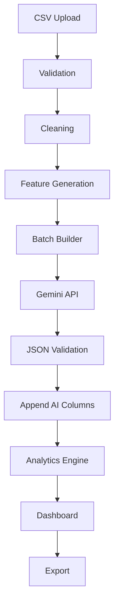

# Data Pipeline
## AI-Powered Customer Feedback Analytics Platform

**Version:** 1.0

---

# Purpose

This document defines the complete data pipeline used by the AI-Powered Customer Feedback Analytics Platform.

The data pipeline is responsible for transforming raw customer reviews into structured business insights through validation, preprocessing, AI enrichment, analytics, and visualization.

This document serves as the implementation guide for developers and AI coding assistants.

---

# Pipeline Overview

```text
Raw Reviews CSV
        │
        ▼
Column Normalization
        │
        ▼
Alias Mapping
        │
        ▼
Fuzzy Matching
        │
        ▼
Schema Validation
        │
        ▼
Preprocessing
        │
        ▼
Gemini AI Enrichment
        │
        ▼
Processed CSV
        │
        ▼
Dashboard
```

---

# Pipeline Stages

| Stage | Purpose |
|---------|----------|
| Upload | Accept CSV |
| Validation | Verify schema |
| Cleaning | Improve data quality |
| Feature Generation | Create derived columns |
| Batch Processing | Reduce API calls |
| Gemini Analysis | Generate AI insights |
| Response Validation | Validate JSON |
| Analytics | Compute KPIs |
| Dashboard | Visualize insights |
| Export | Save processed CSV |

---

# Stage 1 – CSV Upload

## Objective

Receive customer review data from the user.

### Input

CSV File

### Output

Pandas DataFrame

### Validation

- File extension
- Encoding
- Empty file
- Corrupted file

---

# Stage 2 – Dataset Validation

The uploaded CSV must contain:

| Column |
|---------|
| review_id |
| product_name |
| brand |
| category |
| rating |
| review_title |
| review_text |
| review_date |

Validation Rules

- Required columns exist
- Rating is between 1–5
- Review text is not empty
- Dates are valid
- UTF-8 encoding
- No duplicate headers

If validation fails:

- Stop processing
- Display descriptive error

---

# Stage 3 – Data Cleaning

The preprocessing module performs:

- Remove duplicate rows
- Remove blank reviews
- Trim whitespace
- Normalize rating values
- Convert dates to ISO format
- Remove meaningless characters
- Standardize text

Example

Before

```
"This product is AMAZING!!!!   "
```

After

```
"This product is AMAZING!"
```

---

# Stage 4 – Feature Generation

Additional columns generated before AI processing.

| Column | Description |
|---------|-------------|
| review_length | Number of words |
| month | Review month |
| year | Review year |
| cleaned_review | Cleaned review text |

Purpose

Improve downstream analytics.

---

# Stage 5 – Batch Processing

## Why Batch?

Calling Gemini once for every review is inefficient and quickly exhausts API quotas.

Batch processing:

- Reduces API requests
- Improves throughput
- Lowers latency
- Simplifies retry logic

---

## Recommended Batch Size

```
10 Reviews
```

Each request contains up to 10 reviews.

---

# Batch Workflow

```text
100 Reviews

↓

10 Batches

↓

Gemini Request 1

↓

Gemini Request 2

↓

...

↓

Merge Results
```

---

# Stage 6 – Google Gemini Analysis

Each batch is sent to Gemini.

The prompt requests:

- Sentiment
- Complaint Category
- Keywords
- Summary
- Priority

Gemini returns JSON.

Example

```json
{
  "review_id":1001,
  "sentiment":"Positive",
  "summary":"Customer is satisfied.",
  "keywords":["battery","camera"],
  "priority":"Low"
}
```

---

# Prompt Rules

Prompt must request:

- JSON only
- No markdown
- One object per review
- Preserve review_id
- No additional explanation

---

# Stage 7 – Response Validation

Every Gemini response must be validated.

Checks:

- Valid JSON
- Matching review_id
- Required fields
- Correct data types
- No missing values

If validation fails:

Retry request.

---

# Retry Strategy

Maximum retries

```
3
```

Retry Delay

```
Exponential Backoff
```

Example

Attempt 1

↓

3 sec

↓

Attempt 2

↓

6 sec

↓

Attempt 3

↓

12 sec

---

# API Rate Limiting

To avoid quota exhaustion:

- Maximum 10 reviews per request
- Wait 3 seconds between requests
- Stop processing if daily quota is reached
- Resume later from the last successful batch

---

# Resume Processing

If processing stops due to:

- API quota
- Network failure
- Power interruption

The pipeline must:

- Save completed batches
- Skip processed reviews
- Resume from remaining reviews

---

# Caching Strategy

Avoid sending the same review multiple times.

Cache key:

```
hash(cleaned_review)
```

If hash exists:

Return cached result.

Otherwise:

Call Gemini.

---

# Cache Storage

```
data/cache/

gemini_cache.json
```

---

# Stage 8 – AI Enrichment

Append generated columns:

| Column |
|---------|
| sentiment |
| complaint_category |
| keywords |
| summary |
| priority |

Original data must never be modified.

---

# Stage 9 – Analytics Engine

Generate metrics.

Examples

- Total Reviews
- Average Rating
- Positive Reviews
- Neutral Reviews
- Negative Reviews
- Complaint Categories
- Product Ranking
- Brand Ranking
- Monthly Trends

---

# Stage 10 – Dashboard

The dashboard consumes the processed dataset.

Visualizations include:

- KPI Cards
- Pie Charts
- Line Charts
- Bar Charts
- Word Cloud
- Review Explorer
- Filters

---

# Stage 11 – Export

Allow users to download:

- Processed CSV
- Analytics Summary (future)
- PDF Report (future)

---

# Error Handling

Possible Errors

| Error | Action |
|--------|--------|
| Invalid CSV | Stop |
| Missing Columns | Stop |
| API Timeout | Retry |
| Invalid JSON | Retry |
| Quota Exceeded | Save Progress |
| Network Failure | Retry |

---

# Logging

Log:

- Upload Started
- Validation Completed
- Cleaning Completed
- Batch Sent
- Batch Completed
- Retry Attempt
- Cache Hit
- Cache Miss
- Analytics Generated
- Dashboard Loaded

---

# Performance Guidelines

- Process batches sequentially
- Avoid duplicate API requests
- Cache repeated reviews
- Minimize DataFrame copies
- Load only required columns
- Keep memory usage low

---

# Pipeline Diagram



---

# Directory Usage

```
data/

raw/
    Original datasets

processed/
    AI enriched datasets

cache/
    Gemini cache

logs/
    Application logs
```

---

# Acceptance Criteria

The pipeline is complete when:

- CSV uploads successfully
- Validation passes
- Cleaning is completed
- Features are generated
- Reviews are processed in batches
- Gemini responses are validated
- AI columns are appended
- Analytics are generated
- Dashboard displays correct data
- Processed CSV can be downloaded

---

# Future Enhancements

- Kafka-based streaming
- Live customer reviews
- PostgreSQL integration
- Incremental processing
- Apache Airflow orchestration
- Spark for large datasets
- Multi-language NLP
- Sentiment trend prediction

---

# End of Document