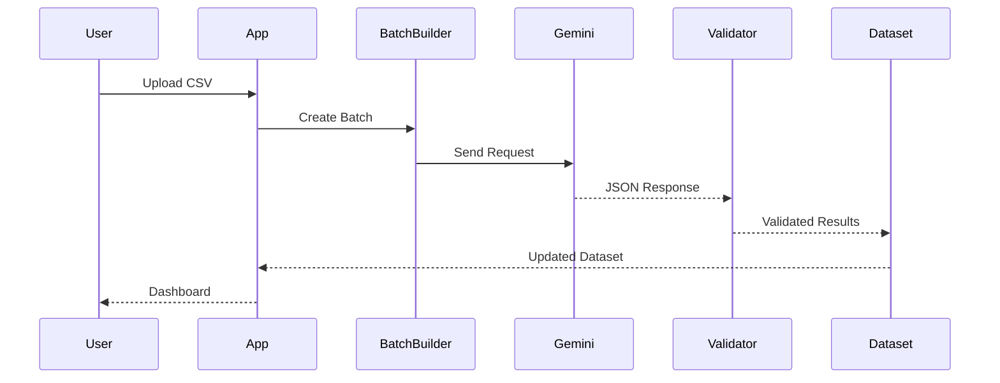

# Google Gemini AI Integration
## AI-Powered Customer Feedback Analytics Platform

**Version:** 1.0

---

# Purpose

This document defines the complete integration strategy for the Google Gemini API used in the AI-Powered Customer Feedback Analytics Platform.

The objectives are:

- Secure API integration
- Batch review processing
- Prompt engineering
- JSON response validation
- Error handling
- Retry mechanism
- Rate limiting
- Response caching
- Cost and quota optimization

This document serves as the implementation guide for developers and AI coding assistants.

---

# AI Workflow Overview

```text
Customer Reviews
        │
        ▼
Batch Builder
        │
        ▼
Prompt Generator
        │
        ▼
Google Gemini API
        │
        ▼
JSON Validation
        │
        ▼
Retry (if needed)
        │
        ▼
Append AI Columns
        │
        ▼
Analytics Engine
```

---

# Gemini Model

Recommended Model

```
gemini-2.0-flash
```

Reason

- Fast response time
- Lower cost
- Suitable for structured text analysis
- Supports JSON generation

---

# Environment Variables

Never hardcode API keys.

Store secrets in:

```
.env
```

Example

```env
GEMINI_API_KEY=your_api_key_here
```

Load using

```python
from dotenv import load_dotenv
import os

load_dotenv()

API_KEY = os.getenv("GEMINI_API_KEY")
```

---

# API Configuration

Recommended configuration

| Setting | Value |
|----------|--------|
| Temperature | 0.2 |
| Top P | 0.9 |
| Top K | 40 |
| Max Output Tokens | 4096 |

Reason

Low temperature produces consistent structured responses.

---

# Prompt Engineering

Each request must instruct Gemini to:

- Analyze customer reviews
- Return JSON only
- Preserve review IDs
- Do not explain results
- Do not generate markdown

---

# Required AI Outputs

For every review generate:

- Sentiment
- Complaint Category
- Summary
- Keywords
- Priority

---

# Prompt Template

```
You are an expert customer feedback analyst.

Analyze the following reviews.

Return ONLY valid JSON.

For every review return:

review_id

sentiment

complaint_category

summary

keywords

priority

Do not include markdown.

Do not include explanations.

Do not omit any review.
```

---

# Example Input

```json
[
  {
    "review_id":1001,
    "review":"Battery backup is excellent."
  },
  {
    "review_id":1002,
    "review":"Camera quality is poor."
  }
]
```

---

# Expected Output

```json
[
  {
    "review_id":1001,
    "sentiment":"Positive",
    "complaint_category":"Battery",
    "summary":"Customer appreciates battery performance.",
    "keywords":["battery","backup"],
    "priority":"Low"
  },
  {
    "review_id":1002,
    "sentiment":"Negative",
    "complaint_category":"Camera",
    "summary":"Customer is dissatisfied with the camera.",
    "keywords":["camera","quality"],
    "priority":"High"
  }
]
```

---

# Batch Processing

Reviews must be processed in batches.

Recommended batch size

```
10 Reviews
```

Advantages

- Lower API usage
- Better throughput
- Easier retries
- Lower quota consumption

---

# Rate Limiting

To prevent API quota exhaustion:

- Maximum 10 reviews per request
- Wait 3 seconds between requests
- Stop when quota is exceeded
- Resume later

---

# Retry Strategy

Retry only when:

- Timeout
- Network failure
- Invalid JSON
- Temporary API error

Maximum retries

```
3
```

---

# Exponential Backoff

Retry schedule

```
Attempt 1

↓

3 sec

↓

Attempt 2

↓

6 sec

↓

Attempt 3

↓

12 sec
```

If all retries fail:

- Save progress
- Log error
- Continue remaining batches

---

# JSON Validation

Every response must be validated.

Checks:

- Valid JSON
- Required fields exist
- review_id matches input
- No duplicate IDs
- Correct data types
- No missing values

If validation fails:

Retry request.

---

# Required JSON Fields

```json
{
  "review_id":0,
  "sentiment":"",
  "complaint_category":"",
  "summary":"",
  "keywords":[],
  "priority":""
}
```

---

# Sentiment Values

Allowed values

```
Positive

Neutral

Negative
```

---

# Priority Values

Allowed values

```
High

Medium

Low
```

---

# Complaint Categories

Examples

- Battery
- Camera
- Display
- Performance
- Delivery
- Packaging
- Software
- Price
- Other

---

# Response Caching

Avoid sending identical reviews multiple times.

Cache key

```
SHA256(cleaned_review)
```

If review exists in cache:

Return cached response.

Otherwise:

Call Gemini.

---

# Cache Location

```
data/cache/

gemini_cache.json
```

---

# Error Handling

Possible errors

| Error | Action |
|--------|--------|
| API Timeout | Retry |
| Network Failure | Retry |
| Invalid JSON | Retry |
| Missing Fields | Retry |
| Quota Exceeded | Save Progress |
| Authentication Error | Stop Processing |

---

# Logging

Log the following events:

- API Request Started
- Batch Number
- Request Time
- Response Time
- Cache Hit
- Cache Miss
- Retry Attempt
- Validation Success
- Validation Failure
- Quota Reached
- Processing Completed

Never log:

- API Keys
- Sensitive credentials

---

# Resume Processing

If processing stops:

Save:

- Completed review IDs
- Current batch
- Cache

Resume from:

First unprocessed batch.

---

# Security Guidelines

Never:

- Hardcode API keys
- Commit `.env`
- Log secrets
- Expose prompts publicly

Always:

- Use environment variables
- Validate responses
- Handle failures gracefully

---

# Performance Optimization

Recommendations

- Process reviews in batches
- Cache repeated reviews
- Avoid duplicate requests
- Reuse API client
- Validate before saving

---

# Integration Sequence



---

# AI Service Responsibilities

The Gemini service is responsible for:

- Creating prompts
- Sending requests
- Parsing responses
- Validating JSON
- Caching results
- Retrying failed requests
- Logging events

The analytics module should never call the API directly.

---

# Future Enhancements

Possible future improvements:

- Streaming AI analysis
- Multi-language sentiment analysis
- Automatic topic modeling
- Emotion detection
- Embedding generation
- AI-powered recommendations
- Function Calling
- Structured Output API

---

# Acceptance Criteria

The AI integration is complete when:

- API key loads from `.env`
- Batch processing works
- JSON responses are validated
- Invalid responses trigger retries
- Cache prevents duplicate requests
- Rate limits are respected
- Logs are generated
- Processed data is appended correctly
- Dashboard receives enriched dataset

---

# Definition of Done

The Gemini integration is considered complete when:

- Secure authentication is implemented.
- Prompt produces consistent JSON.
- All responses pass validation.
- Retry logic works correctly.
- Caching reduces repeated API calls.
- Error handling is reliable.
- API quotas are respected.
- Documentation is updated.

---

# End of Document
