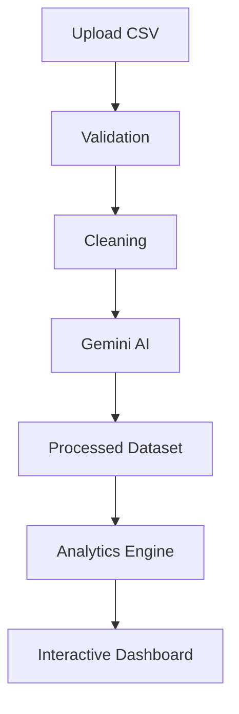

# Dashboard Design
## AI-Powered Customer Feedback Analytics Platform

**Version:** 1.0

---

# Purpose

This document defines the user interface, dashboard layout, visualization strategy, navigation flow, filters, KPIs, and interaction design of the AI-Powered Customer Feedback Analytics Platform.

The dashboard transforms AI-enriched customer reviews into interactive business insights for decision-makers.

---

# Dashboard Objectives

The dashboard should enable users to:

- Upload customer review datasets
- Analyze sentiment distribution
- Monitor product performance
- Identify common customer complaints
- Track rating trends
- Search and filter reviews
- Generate business insights
- Download processed datasets

---

# Dashboard Technology

| Component | Technology |
|-----------|------------|
| Frontend | Streamlit |
| Charts | Plotly |
| Data Processing | Pandas |
| AI Analysis | Google Gemini |
| Styling | Streamlit + Custom CSS |

---

# Navigation Structure

```
Dashboard

├── Home
├── Upload Dataset
├── Overview
├── Product Analytics
├── Brand Analytics
├── Category Analytics
├── Complaint Analysis
├── Review Explorer
├── AI Insights
├── Reports
└── Settings
```

---

# User Workflow

```text
Launch Application
        │
        ▼
Upload CSV
        │
        ▼
Validate Dataset
        │
        ▼
AI Processing
        │
        ▼
Generate Analytics
        │
        ▼
Display Dashboard
        │
        ▼
Explore Insights
        │
        ▼
Download Processed CSV
```

---

# Dashboard Layout

```
+------------------------------------------------------+
| Header                                                |
+------------------------------------------------------+

+--------------+---------------------------------------+
| Sidebar      | Main Dashboard                        |
| Navigation   |                                       |
| Filters      | KPI Cards                             |
| Upload       | Charts                                |
| Export       | Tables                                |
|              | AI Insights                           |
+--------------+---------------------------------------+
```

---

# Sidebar

The sidebar contains:

- Dataset Upload
- Navigation
- Filters
- Date Selection
- Brand Filter
- Product Filter
- Category Filter
- Sentiment Filter
- Download Button

---

# Header

Display:

- Project Title
- Current Dataset
- Total Reviews
- Processing Status
- Last Updated Time

---

# Home Page

Displays:

- Welcome Message
- Project Overview
- Dataset Status
- Quick Navigation
- Upload Button

---

# Dataset Upload Page

Features:

- CSV Upload
- Dataset Preview
- Validation Status
- Record Count
- Missing Value Summary

---

# Overview Dashboard

Displays key business metrics.

---

## KPI Cards

Display:

- Total Reviews
- Positive Reviews
- Neutral Reviews
- Negative Reviews
- Average Rating
- Total Products
- Total Brands
- Total Categories

---

# KPI Layout

```
+------------+------------+------------+------------+
| Reviews    | Rating     | Positive   | Negative   |
+------------+------------+------------+------------+

+------------+------------+------------+------------+
| Products   | Brands     | Categories | AI Status  |
+------------+------------+------------+------------+
```

---

# Sentiment Analysis

Visualization

Pie Chart

Displays:

- Positive
- Neutral
- Negative

Purpose

Understand overall customer satisfaction.

---

# Rating Distribution

Visualization

Bar Chart

Displays:

Ratings

1

2

3

4

5

---

# Monthly Trend

Visualization

Line Chart

Displays

Number of reviews over time.

---

# Product Analytics

Displays:

- Top Products
- Highest Rated Products
- Lowest Rated Products
- Product Sentiment
- Product Complaint Categories

Charts

- Horizontal Bar Chart
- Pie Chart
- Table

---

# Brand Analytics

Displays

- Reviews by Brand
- Average Rating
- Sentiment Distribution
- Complaint Breakdown

Charts

- Bar Chart
- Pie Chart

---

# Category Analytics

Displays

- Category Popularity
- Category Ratings
- Sentiment
- Complaint Distribution

---

# Complaint Analysis

Displays

Top Complaint Categories

Examples

Battery

Camera

Delivery

Packaging

Software

Performance

Charts

- Bar Chart
- Treemap (Future)
- Table

---

# Keyword Analysis

Displays

Most frequent keywords generated by Gemini.

Visualization

Word Cloud

Bar Chart

---

# Review Explorer

Interactive table.

Columns

- Review ID
- Product
- Brand
- Rating
- Sentiment
- Complaint Category
- Summary
- Priority

Features

- Search
- Sort
- Pagination
- Filters

---

# Review Detail View

Selecting a review displays:

Original Review

AI Summary

Keywords

Sentiment

Priority

Complaint Category

---

# AI Insights Page

Displays

Business insights generated from analytics.

Examples

- Most common complaints
- Best performing brands
- Products requiring attention
- Customer satisfaction summary
- Monthly observations

---

# Reports Page

Displays

- KPI Summary
- Charts
- AI Insights
- Export Options

---

# Filters

Supported filters

- Date Range
- Brand
- Product
- Category
- Rating
- Sentiment
- Complaint Category
- Priority

All charts should update dynamically.

---

# Search

Global search across:

- Product Name
- Brand
- Review Text
- Keywords
- Complaint Category

---

# Export Options

Users can download:

- Processed CSV
- Analytics Summary (Future)
- PDF Report (Future)

---

# Color Guidelines

Suggested semantic colors

| Metric | Color |
|---------|--------|
| Positive | Green |
| Neutral | Yellow |
| Negative | Red |
| KPI Cards | Blue |
| Background | White |
| Text | Dark Gray |

---

# Dashboard Performance

Requirements

- Fast page loading
- Lazy chart rendering
- Efficient DataFrame filtering
- Cached analytics
- Responsive layout

---

# Accessibility

Dashboard should provide:

- High contrast text
- Readable font sizes
- Keyboard navigation where possible
- Clear chart labels

---

# Dashboard Data Flow



---

# Page Navigation Flow

```mermaid
flowchart LR

Home
--> Upload
--> Overview
--> Product Analytics
--> Brand Analytics
--> Complaint Analysis
--> Review Explorer
--> Reports
```

---

# Future Enhancements

Future dashboard improvements may include:

- Real-time streaming updates
- Live sentiment monitoring
- Drill-down analytics
- Geographical insights
- User authentication
- Role-based dashboards
- Dark mode
- Mobile responsiveness
- Predictive analytics

---

# Acceptance Criteria

The dashboard is complete when:

- Users can upload CSV files.
- KPIs display correctly.
- Charts update dynamically.
- Filters work across all pages.
- AI-generated insights are visible.
- Review Explorer supports search and sorting.
- Processed CSV can be downloaded.

---

# Definition of Done

The dashboard design is considered complete when:

- Navigation is intuitive.
- Analytics are interactive.
- Visualizations are accurate.
- AI insights are integrated.
- Performance is optimized.
- Future enhancements are documented.

---

# End of Document